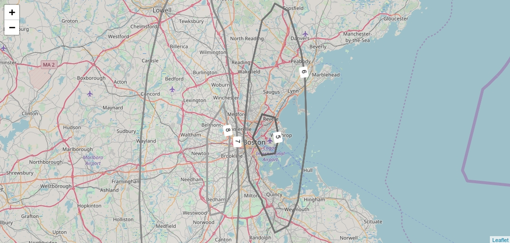

## leaflet-isolines
[Leaflet](http://www.leafletjs.com) plugin for draw isolines.
Used [turfjs](http://turfjs.org/), isolines caclulating in worker.

### Example
[Open](https://grinat.github.io/leaflet-isolines/examples/index.html) (see in /examples)



### Usage
```
import 'leaflet'
// import script after leaflet
import 'leaflet-isolines'
import 'leaflet-isolines/dist/leaflet-isolines.css'

// points for calc
var points = [
   [lat, lng, value],
   ...
]
//values for which will be drawn isolines
var breaks = [1, 2, ...]

// see options section
var options = {}

// init
var isoline = L.leafletIsolines(points, breaks, options)
isoline.on('start', function () {
  // on start calc isolines in worker
})
isoline.on('end', function (evt) {
  // on end calc isolines in worker
})
isoline.on('error', function (evt) {
  // on error
  console.error(evt.msg)
})
isoline.addTo(map)
```

For use with https://github.com/bbecquet/Leaflet.PolylineDecorator
```
import 'leaflet'
import 'leaflet-polyline-decorator'
// import script after leaflet
import 'leaflet-isolines'
import 'leaflet-isolines/dist/leaflet-isolines.css'

L.leafletIsolines([
  [lat, lng, value],
  ...
], [1, 2, ...], options).addTo(map)
```


### Events

start - on start calculating

end - on end calculating

error => ({msg})

isolineMarker.add => ({
 marker,
 coordinates,
 properties
})

polyline.add => ({
 layer,
 coordinates,
 properties
})

polygon.add => ({
 layer,
 coordinates,
 properties
})

### Options

```
    // caption of isoline which showed on isoline
    isolyneCaption: (propVal) => propVal.toString(),
    // L.polyline options
    polylineOptions: (propVal, dataObj) => ({
      color: 'red',
      fillColor: 'blue'
    }),
    // L.polygon or L.polylineDecorator options
    polygonOptions: (propVal, dataObj) => ({
      color: 'red',
      fillColor: 'blue'
    }),
    // marker options
    isolineMarkerOptions: (propVal, dataObj) => ({
      rotate: true,
      showedPosition: 'center'
    }),
    // increases the area in which the isolines are calculated
    // [ [lat, lng], [lat, lng] ... ]
    bounds: [],
    showPolylines: true,
    showPolygons: true,
    showIsolineMarkers: true,
    // save result of calc in global variable or not
    // results cached on coords hash
    enableCache: false
```
